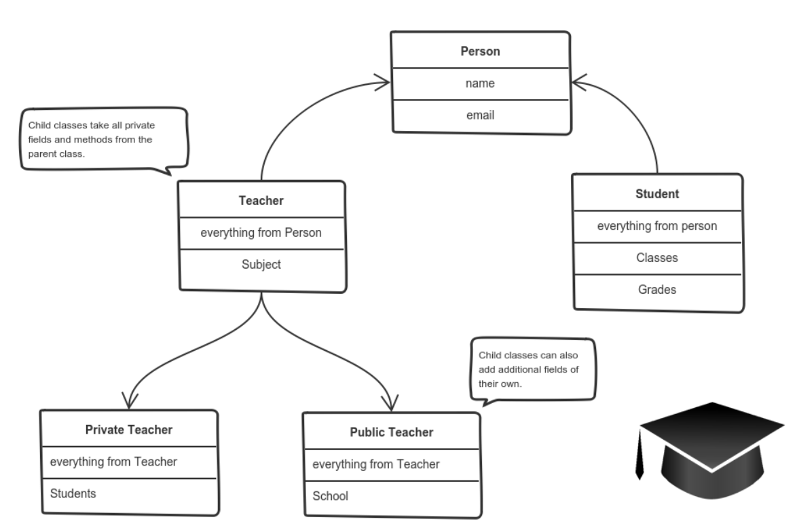

# Inheritance
[Code Example (Python)](https://www.geeksforgeeks.org/inheritance-in-python/)

[Another Python Resource](https://www.digitalocean.com/community/tutorials/understanding-class-inheritance-in-python-3)

[C# Resource](https://docs.microsoft.com/en-us/dotnet/csharp/tutorials/inheritance)

How do we reuse the common logic and extract the unique logic into a separate class? One way to achieve this is inheritance.

It means that you create a (child) class by deriving from another (parent) class. This way, we form a hierarchy.

In the image below, a private teacher is a type of teacher. And any teacher is a type of Person.

Each class adds only what is necessary for it while reusing common logic with the parent classes.



So here’s a parent class in Python:
```python
class Ball:
    def __init__(self):
        self.radius = 0
        self.weight = 0
        self.shape = 'sphere'
```

Both Baseball and Football inherit the Ball class and then add their own properties that are specific to the class of Baseball and Football.
```python
class Baseball(Ball):
    def __init__(self):
        self.stitches = 0

class Football(Ball):
    def __init__(self):
        # default shape of 'sphere' is overriden here
        self.shape = 'oval'
        self.material = 'leather'
```
C# version of inheritance:
```cs
public class Ball {
    public int radius = 0;
    public int weight = 0;
    public string shape = "Sphere";
}

public class Baseball : Ball {
    public int stitches = 0;
}

public class Football : Ball {
    # default shape of 'sphere' is overriden here
    public override string shape = 'oval';
    public string material = "leather";
}
```